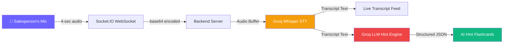

# 🤖 Real-Time AI Sales Copilot — Overview

## What Is It?

The **Real-Time AI Sales Copilot** is a live, in-call AI assistant that listens to sales conversations and provides instant, actionable coaching hints to the sales representative — while the call is still happening.

It is a core feature of the **AI Conversation Intelligence & Action Platform (AISI)**.

---

## How It Works

### Step-by-Step Flow

| Step | What Happens | Technology |
|------|-------------|------------|
| 1 | Salesperson clicks the mic orb on the **Live Copilot** page | React Frontend |
| 2 | Browser captures microphone audio in 4-second recording cycles | `MediaRecorder` API |
| 3 | Each 4-second audio file is **base64 encoded** and sent to the backend | Socket.IO (WebSocket) |
| 4 | Backend decodes the audio and sends it to **Groq Whisper** for transcription | `whisper-large-v3-turbo` |
| 5 | The transcript text appears in the **Live Transcript Feed** (left panel) | `transcript:final` event |
| 6 | The transcript is also sent to the **AI Hint Engine** (Groq LLM) | `llama-3.3-70b-versatile` |
| 7 | The LLM analyzes the conversation context and generates a coaching hint | JSON structured output |
| 8 | The hint appears as a **color-coded flashcard** on the right panel | `copilot:hint` event |
| 9 | When the session stops, a **Post-Session AI Summary** is generated | `session:summary` event |

---

## What the Copilot Provides During a Call

### 4 Types of Real-Time Hints

| Type | Color | Trigger Example | AI Response |
|------|-------|----------------|-------------|
| 🔴 **OBJECTION** | Red | *"Your price is too high"* | Counter-argument strategy |
| 🔵 **QUESTION** | Blue | *"Does it integrate with HubSpot?"* | Suggested answer |
| 🟢 **BUYING_SIGNAL** | Green | *"What are the next steps?"* | Closing strategy |
| 🟡 **COACHING** | Yellow | Rep talking too much | *"Ask an open-ended question"* |

### Post-Session Analytics Dashboard

After stopping the session, the AI generates:

| Metric | Description |
|--------|-------------|
| 😊 Sentiment | Overall call sentiment (positive/neutral/negative) |
| 📊 Deal Probability | 0-100% likelihood of closing |
| ⭐ Rep Score | Performance rating out of 10 |
| 📝 Executive Summary | 3-4 sentence overview |
| 🎯 Action Items | Priority-coded tasks with deadlines |
| 💡 Hint Breakdown | Visual chart of hint types generated |
| ➡️ Next Best Action | The single most important follow-up |
| ✉️ Follow-Up Email | Ready-to-send email draft with copy button |

---

## Technical Architecture

### Backend Files — `Backend/modules/copilot/`

| File | Role |
|------|------|
| `copilot.socket.js` | WebSocket handler — session lifecycle, audio buffering, hint/summary triggers |
| `transcription.service.js` | Groq Whisper integration — converts audio → text |
| `hint.service.js` | AI Hint Engine — analyzes transcript → generates coaching hints |
| `summary.service.js` | Post-session summary — generates analytics after session ends |

### Frontend File

| File | Role |
|------|------|
| `pages/LiveCopilot.jsx` | Full UI — mic orb, transcript feed, hint flashcards, analytics dashboard |

### Key Dependencies

| Package | Used For |
|---------|----------|
| `socket.io` / `socket.io-client` | Real-time bidirectional communication |
| `groq-sdk` | Whisper STT + LLM inference |

### Environment

| Variable | Purpose |
|----------|---------|
| `GROQ_API_KEY` | API key for Groq (Whisper + LLM) |
| `JWT_SECRET` | Socket authentication |

---

## Current Limitations (v1)

1. **Single microphone** — both customer and salesperson voices are captured from one mic. No speaker diarization.
2. **Generic hints** — the AI gives general sales advice (e.g., "provide product details") but does not have access to actual product databases.
3. **No talk tracks** — hints tell the rep *what to do* but not the *exact words to say*.
4. **No knowledge base** — if a customer asks a specific question (e.g., "which variants of Tata Nexon are under 15 lakhs?"), the AI cannot look up the real answer.

> These limitations are addressed in the **v2 Upgrade Plan** (see the implementation plan document).
