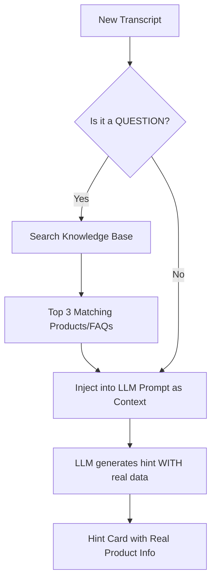

# 🚀 AI Copilot v2 — Upgrade Implementation Plan

## Overview

This document details the two major upgrades we are adding to the Real-Time AI Sales Copilot:

| Upgrade | What It Does | Impact |
|---------|-------------|--------|
| **Talk Tracks** | Instead of "provide product details", the AI gives the **exact sentence** the rep should say | Rep goes from *thinking* to *reading* — 10x faster response |
| **RAG Knowledge Base** | Instead of generic advice, the AI **searches a product database** and returns real data (specs, prices, comparisons) | Rep can answer *any* specific question instantly |

---

## Upgrade 1: Talk Tracks (Exact Scripts)

### The Problem (v1)

Currently when a customer asks *"What variants of Tata Nexon come under 15 lakhs?"*, the AI hint says:

```
🔵 QUESTION
Hint: "Provide details about Tata Nexon variants in the customer's budget range"
Detail: "Share specific model names and pricing to build credibility"
```

The rep still has to figure out WHAT to say. In a live call, that 5-second delay kills momentum.

### The Solution (v2)

The AI hint will now include a `talkTrack` field — the **exact sentence** the rep can read aloud:

```
🔵 QUESTION  
Hint: "Tata Nexon variants under ₹15-16 Lakhs"
Talk Track: "Great question, Rahul! In that range, you have three excellent 
options: the Nexon Smart+ at ₹14.5L, the Nexon Creative at ₹15.2L, and the 
Nexon Fearless at ₹15.8L. The Creative is our best seller — it includes a 
sunroof, ventilated seats, and a 10.25-inch touchscreen. Would you like me 
to compare any two of these?"
```

### What Changes

| File | Change |
|------|--------|
| `hint.service.js` | Update the LLM system prompt to include a `talkTrack` field in the JSON response |
| `LiveCopilot.jsx` | Add a "Talk Track" section inside each hint card with a copy-to-clipboard button |

### Updated Hint JSON Schema

```json
{
  "type": "OBJECTION | QUESTION | BUYING_SIGNAL | COACHING",
  "hint": "Short label (what happened)",
  "detail": "Brief context for the rep",
  "talkTrack": "The exact sentence the rep should say out loud, word for word",
  "trigger": "The customer's exact words that triggered this hint",
  "confidence": 0.85
}
```

### Updated LLM Prompt Addition

```
IMPORTANT: For every hint, you MUST include a "talkTrack" field.
This is the EXACT sentence the salesperson should say out loud.
Rules for talkTrack:
- Write it as natural, conversational speech (not robotic)
- Include the customer's name if available
- Reference specific details from the conversation
- Keep it under 3 sentences
- End with an open-ended question to keep the conversation going
- For OBJECTION type: acknowledge the concern, then pivot to value
- For QUESTION type: give a direct answer, then ask a follow-up
- For BUYING_SIGNAL type: confirm interest, suggest the next step
- For COACHING type: give the rep a specific phrase to say
```

### UI Enhancement

Each hint flashcard will have a new section below the hint text:

```
┌─────────────────────────────────────┐
│ 🔵 CUSTOMER QUESTION               │
│                                     │
│ "What variants under 15 lakhs?"     │
│                                     │
│ 💬 SAY THIS:                        │
│ ┌─────────────────────────────────┐ │
│ │ "Great question! In that range, │ │
│ │ you have the Nexon Smart+ at    │ │
│ │ ₹14.5L and the Creative at     │ │
│ │ ₹15.2L. Want me to compare?"   │ │
│ └─────────────────────────────────┘ │
│                            [📋 Copy]│
│ ▓▓▓▓▓▓▓▓▓▓▓▓░░░░░░░░  (12s)       │
└─────────────────────────────────────┘
```

---

## Upgrade 2: RAG Knowledge Base (Product Database)

### The Problem (v1)

The AI Hint Engine runs on a general-purpose LLM (`llama-3.3-70b-versatile`). It has no access to the company's actual product catalog, pricing, or specifications. So when a customer asks a specific product question, the AI can only say *"provide more details"* — it can't provide the actual details.

### The Solution (v2)

We add a **Knowledge Base** — a JSON file (or MongoDB collection) containing the company's products, features, pricing, and FAQs. Before generating a hint, the system searches this knowledge base for relevant entries and injects them into the LLM prompt as context.

### Architecture



### Knowledge Base Schema

A new JSON file or MongoDB collection that stores the company's product data:

```json
// Backend/data/knowledge-base.json
{
  "company": "Tata Motors",
  "products": [
    {
      "id": "nexon-smart-plus",
      "name": "Tata Nexon Smart+",
      "category": "SUV",
      "price": 1449900,
      "priceFormatted": "₹14.50 Lakhs",
      "engine": "1.2L Turbo Petrol / 1.5L Diesel",
      "power": "120 PS",
      "mileage": "17.4 km/l",
      "safety": "5-Star GNCAP",
      "keyFeatures": ["LED DRLs", "7-inch Touchscreen", "Dual Airbags", "ABS with EBD"],
      "bestFor": "Budget-conscious buyers wanting safety",
      "competitors": ["Hyundai Venue S", "Maruti Brezza LXi"],
      "tags": ["suv", "nexon", "compact", "budget", "safe", "petrol", "diesel"]
    },
    {
      "id": "nexon-creative",
      "name": "Tata Nexon Creative",
      "category": "SUV",
      "price": 1520000,
      "priceFormatted": "₹15.20 Lakhs",
      "engine": "1.2L Turbo Petrol / 1.5L Diesel",
      "power": "120 PS",
      "mileage": "17.4 km/l",
      "safety": "5-Star GNCAP",
      "keyFeatures": ["Sunroof", "Ventilated Seats", "10.25-inch Touchscreen", "Wireless Charging", "6 Airbags"],
      "bestFor": "Best value-for-money with premium features",
      "competitors": ["Hyundai Venue SX", "Kia Sonet HTX"],
      "tags": ["suv", "nexon", "mid-range", "sunroof", "premium", "best-seller"]
    }
  ],
  "faqs": [
    {
      "question": "What is the warranty?",
      "answer": "All Tata vehicles come with a standard 2-year/75,000 km warranty, extendable to 5 years.",
      "tags": ["warranty", "guarantee", "coverage"]
    },
    {
      "question": "Do you offer financing?",
      "answer": "Yes, we partner with SBI, HDFC, and ICICI for financing at rates starting from 8.5% p.a. with EMIs as low as ₹15,999/month.",
      "tags": ["finance", "emi", "loan", "bank", "payment"]
    }
  ],
  "objectionHandlers": [
    {
      "objection": "Price is too high",
      "response": "I understand the concern. Let me share something — our Nexon has the highest resale value in the segment at 65% after 3 years. When you factor in the 5-star safety rating and lower maintenance costs, the total cost of ownership is actually 12% lower than Venue over 5 years.",
      "tags": ["price", "expensive", "cost", "budget", "competitor"]
    },
    {
      "objection": "Competitor is better",
      "response": "That's a fair comparison. The key differentiator is safety — Nexon is the only 5-star GNCAP rated car in this segment. Plus, our connected car features with iRA are included free for 5 years, while competitors charge ₹10,000/year.",
      "tags": ["competitor", "gong", "venue", "brezza", "comparison"]
    }
  ]
}
```

### What Changes

| File | Change | Description |
|------|--------|-------------|
| **NEW** `Backend/data/knowledge-base.json` | New file | The product/FAQ database |
| **NEW** `Backend/modules/copilot/knowledge.service.js` | New file | Search engine that finds relevant KB entries based on transcript keywords |
| `Backend/modules/copilot/hint.service.js` | Modified | Before calling LLM, searches KB and injects matching products/FAQs into the prompt |
| `Frontend/LiveCopilot.jsx` | Modified | Hint cards show product details (name, price, features) in a structured format |

### Knowledge Base Search Logic

```
// knowledge.service.js (pseudocode)

function searchKnowledgeBase(transcriptText, callContext) {
  1. Extract keywords from the latest transcript
  2. Search products[] by matching tags, name, category, price range
  3. Search faqs[] by matching tags and question similarity
  4. Search objectionHandlers[] by matching tags
  5. Return top 3 most relevant results
  6. Format them as context for the LLM prompt
}
```

### Price Range Detection

When the customer mentions a price range (e.g., "15-16 lakhs"), the service will:
1. Parse the numbers from the transcript
2. Filter products where `price >= min && price <= max`
3. Return matching products sorted by relevance

### Updated LLM Prompt with KB Context

```
KNOWLEDGE BASE CONTEXT (use this data to answer customer questions):

MATCHING PRODUCTS:
1. Tata Nexon Smart+ — ₹14.50L — 1.2L Turbo, 120PS, 5-Star Safety
   Features: LED DRLs, 7-inch Touchscreen, Dual Airbags
   Best for: Budget-conscious buyers wanting safety

2. Tata Nexon Creative — ₹15.20L — 1.2L Turbo, 120PS, 5-Star Safety
   Features: Sunroof, Ventilated Seats, 10.25-inch Touchscreen, 6 Airbags
   Best for: Best value-for-money with premium features

MATCHING FAQ:
Q: Do you offer financing?
A: Yes, we partner with SBI, HDFC, ICICI. Rates from 8.5% p.a., EMIs from ₹15,999/mo.

IMPORTANT: Use the above data to create specific, data-driven talk tracks.
Include exact model names, prices, and features. Do NOT make up information.
```

---

## Implementation Order

| Step | Task | Effort |
|------|------|--------|
| 1 | Create `knowledge-base.json` with sample product data | 15 min |
| 2 | Create `knowledge.service.js` — keyword search + price range matching | 30 min |
| 3 | Update `hint.service.js` — add KB search before LLM call + add `talkTrack` to prompt | 20 min |
| 4 | Update `LiveCopilot.jsx` — add Talk Track UI section in hint cards | 15 min |
| 5 | Test with the conversation script | 10 min |

**Total estimated time: ~1.5 hours**

---

## Testing Strategy

### Test Scenario: Car Dealership Sales Call

**Call Context:**
- Customer: Rahul Mehta
- Product: Tata Nexon
- Call Type: Sales Call

**Test Script:**

| Customer Says | Expected Copilot Response |
|--------------|--------------------------|
| "What Nexon variants are under 15 lakhs?" | 🔵 Shows Nexon Smart+ (₹14.50L) with specs + talk track |
| "That's too expensive, Hyundai Venue is cheaper" | 🔴 Shows objection handler about resale value + safety + talk track |
| "Do you offer EMI options?" | 🔵 Shows FAQ: SBI/HDFC/ICICI, 8.5% p.a., ₹15,999/mo + talk track |
| "I want to book a test drive this weekend" | 🟢 Buying signal! Talk track: confirm booking, suggest best variant |

---

## What This Means for the Product

> **Before (v1):** *"Provide more information about the product variants in the customer's budget"*
>
> **After (v2):** *"Say this: 'Great question, Rahul! In that range, you have the Nexon Smart+ at ₹14.50 Lakhs with dual airbags and LED DRLs, and the Nexon Creative at ₹15.20 Lakhs which is our best seller — it includes a sunroof, ventilated seats, and a 10.25-inch touchscreen. Would you like me to compare these two?'"*

This transforms the copilot from a **generic advisor** into an **intelligent sales assistant with real product knowledge**.
